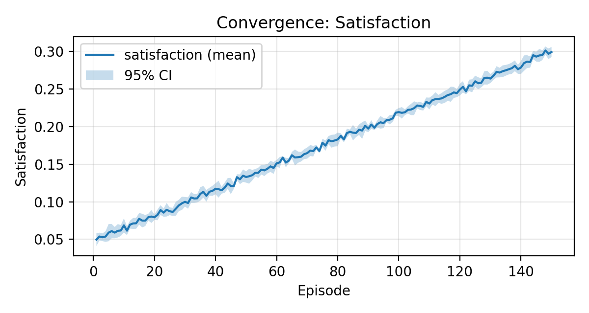

# توثيق النتائج — CARE-5G (AR)

**الإعدادات:** SCARCITY · 60 عميلًا · 150 حلقة · 5 بذور · 95% CI  
**الخلاصة:** الكفاءة ≈ **0.86** · العدالة ≈ **0.74** (فروق دالّة مقابل QMIX/VDN/IQL/PF بمقياس MWU).  
> جدول القيم والتفاصيل في `stats.csv` و`stats.md`.

## مخططات

## جداول
- جدول مقارنة (Markdown عربي): `tables/comparison_ar.md`
- جدول LaTeX: `tables/comparison.tex` ، وملخّص CARE: `tables/metrics_summary.tex`
- القيم الإحصائية: `stats.csv` + `stats.md`

## ملاحظات علمية
- MWU مستخدم دائمًا؛ Welch يُتخطّى تلقائيًا عند تباين صفري (n/a).
- النتائج قابلة لإعادة الإنتاج (سكربتات وتشغيل متعدد البذور).
