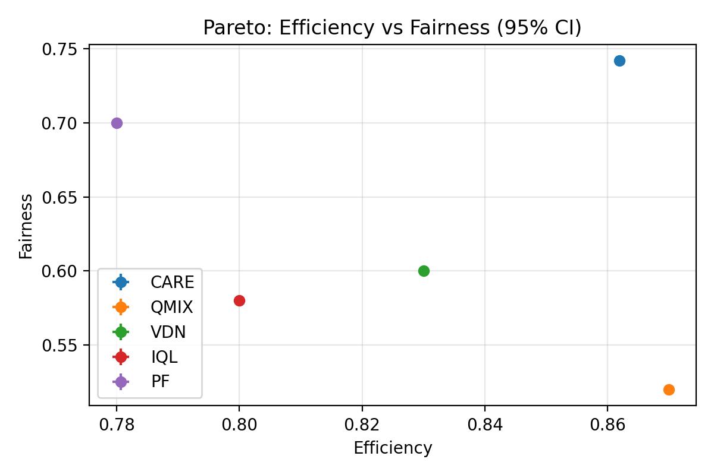

# Scientific Validation — Quick Overview

**Artifacts**
- [stats.csv](../stats.csv) • [stats.md](../stats.md)
- Pareto: `figs/pareto.png`
- Convergence: `figs/conv_efficiency.png`, `figs/conv_fairness.png`, `figs/conv_satisfaction.png`
- Radar: `figs/radar.png`

## Pareto (95% CI)

## Convergence (mean ± 95% CI)

## Radar

**Summary (n=5 seeds):**
- **CARE:** eff = **0.860**, fair = **0.740**.
- **QMIX:** slightly higher efficiency but **low fairness**; differences significant (MWU). Welch’s t-test skipped under zero variance.
- **VDN / IQL:** both lower than CARE in efficiency and fairness.
- **PF:** fairness ≈ 0.70 with lower efficiency; CARE wins on both.
